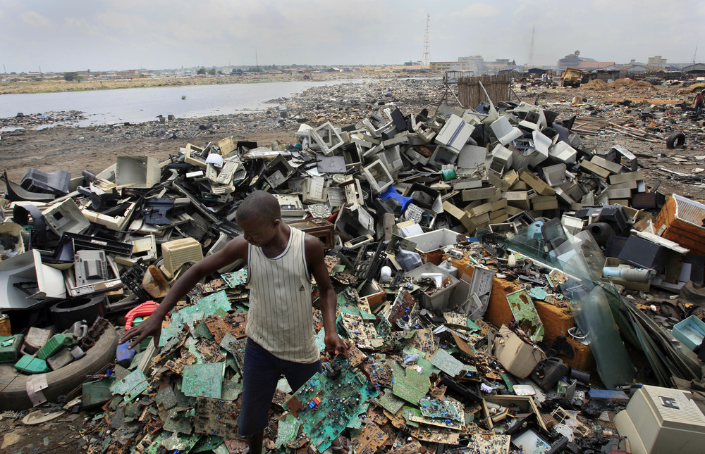
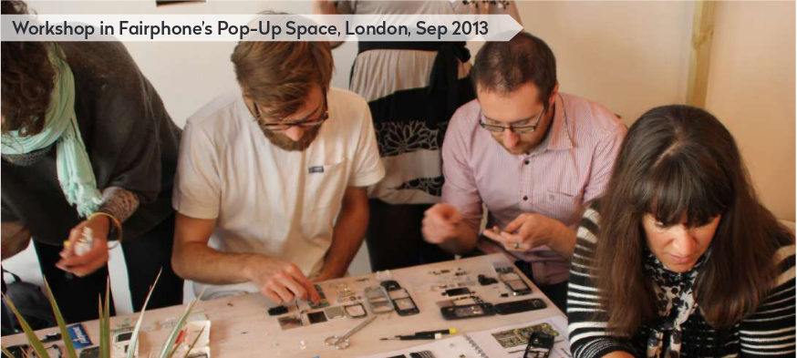

# ¿Cuál es el mejor celular?

¿qué tenemos en cuenta al momento de comprar un equipo?

# Un celular mejor es aquel que se fabrica de manera más justa

según la visión de Fairphone

# industria electrónica

# industria electrónica

#

1. vida media de un celular: 18 meses
2. mil millones de cel por año
3. 468.000 cel son desechados c/día
4. 65 millones tons de basura electrónica (2017)
5. 15% al 20% de los aparatos electrónicos se reciclan
6. 85% e-waste en los vertederos o en incineradoras
7. e-waste, sector que + rápido crece en residuos urbanos
8. e-waste: productos tóxicos (mercurio, plomo, cadmio)
9. c/ millón de cels que se reciclan se recuperan 34 kilos de oro, 350 kilos de plata y 16.000 kilos de cobre

Fuente: Greenpeace, EPA, The World Counts

# generar un impacto positivo en la manera de fabricar, usar y reciclar los teléfonos

Celular modular, diseñado para durar

# objetivos de fairphone

Generar un impacto social y medioambiental positivo de principio a fin del ciclo de vida del teléfono

- Extensión de la vida útil
- Materiales Justos
- Buenas condiciones de trabajo
- Reutilización y Reciclaje

# Extensión de la vida útil

- Productos diseñados para durar
- Primer móvil modular del mundo
- Posibilidad de repararlo
- Sustituir la pantalla en menos de un min
- Seis módulos

# objetivos

- productos que duran más
- modulares
- fácil reparación
- software abierto
- minimizar huella medioambiental

# Materiales Justos

- materiales tienen impacto en las personas y en el planeta
- se rastrea la procedencia de las piezas
- compras responsables en zonas de conflicto
- usar más materiales reciclados

# enfoque

un cambio positivo en las cadenas de suministro de materiales al desarrollar un marco que permite comprender mejor los problemas, obtener materiales de forma más responsable, aumentar el uso de materiales reciclados y buscar activamente socios que ayuden a alcanzar estas metas

# Buenas condiciones de trabajo

# Reutilización y Reciclaje

- economía circular
- fomentar la reutilización y reparación
- investigar las opciones de reciclaje
- reducir los desechos electrónicos

#

#

#

# Características técnicas

#

# Links

[http://www.fairphone.com/es](http://www.fairphone.com/es)

[https://www.facebook.com/Fairphone](https://www.facebook.com/Fairphone)

[https://twitter.com/fairphone](https://twitter.com/fairphone)

[https://instagram.com/fairphone](https://instagram.com/fairphone)

presentación  
[https://cutral.github.io/fairphone](https://cutral.github.io/fairphone)
